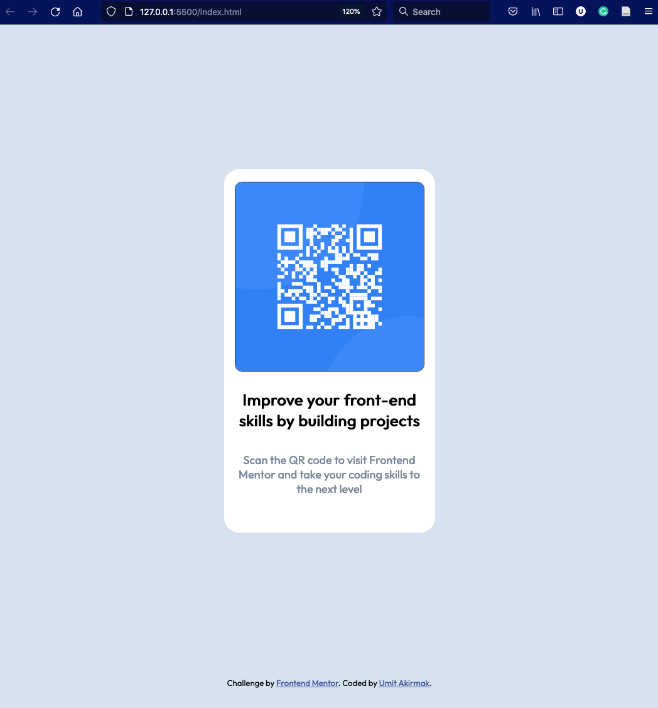

# Frontend Mentor - QR code component solution

This is a solution to the [QR code component challenge on Frontend Mentor](https://www.frontendmentor.io/challenges/qr-code-component-iux_sIO_H). Frontend Mentor challenges help you improve your coding skills by building realistic projects. 

## Table of contents

- [Overview](#overview)
  - [Screenshot](#screenshot)
  - [Links](#links)
- [My process](#my-process)
  - [Built with](#built-with)
  - [What I learned](#what-i-learned)
  - [Continued development](#continued-development)
  
- [Author](#author)
- [Acknowledgments](#acknowledgments)

**Note: Delete this note and update the table of contents based on what sections you keep.**

## Overview

### Screenshot

### Links

- Solution URL: [https://github.com/uakirmak/UA---Frontend-Mentor---QR-code-component]
- Live Site URL: [https://uakirmak.github.io/UA---Frontend-Mentor---QR-code-component/]

## My process
I first coded the HTML part and then moved styling the page. It took a while to figure out the size ratios of the html elements, but I think, I got them right. 

### Built with
- VsCode
- Semantic HTML5 markup
- CSS custom properties
- Flexbox

### What I learned

This was somewhat easy to code. I utilized a flexbox container.
For the image file, I had to update the URL link several times for it to work. Tried relaitve and direct links. It seems to be working now.

### Continued development

I want to learn more about using relative links to files.
Also, I want to learn more about simple designs. I probably did not need to use a flexbox here.
Finally, I did not use a media query but would like to use them in the future.

## Author

- Frontend Mentor - [@uakirmak](https://www.frontendmentor.io/profile/uakirmak)

